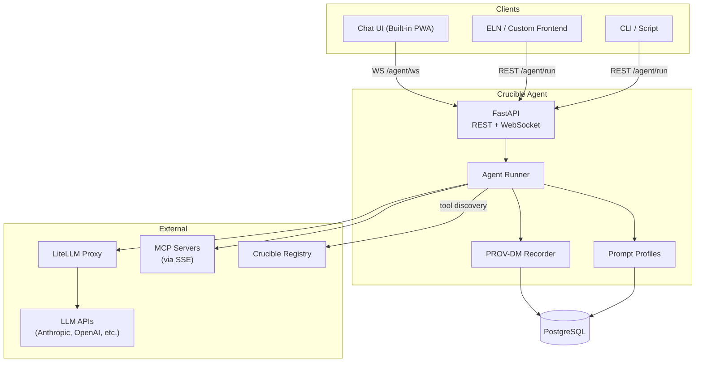
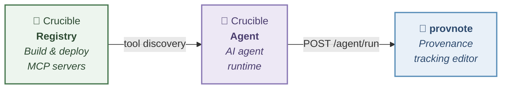

# Crucible Agent

AI agent runtime that connects any frontend to MCP servers via LLM — domain behavior is driven by swappable prompt profiles.

## Features

- **Built-in Chat UI** — 3-column web interface with real-time streaming, session history, and provenance graph visualization. Installable as a PWA on mobile.
- **WebSocket Streaming** — Real-time text and tool execution events via WebSocket. REST API also available for synchronous use.
- **W3C PROV-DM Provenance** — Every conversation, tool call, and LLM invocation is recorded as a provenance graph. Visualize lineage with Cytoscape.js.
- **Multi-Model LLM Support** — Switch between Anthropic, OpenAI, Gemini, Groq, Ollama, and more at runtime. Add or remove models dynamically via API.
- **Swappable Prompt Profiles** — Domain-specific system prompts (e.g. general, science) with CRUD management. Layer custom instructions per session.
- **MCP Tool Auto-Discovery** — Automatically detect available tools from Crucible Registry. Falls back to local config if registry is unavailable.
- **Session Branching & Editing** — Branch conversations from any message, edit past messages, and quote across sessions — all with full provenance tracking.
- **Plan Mode** — Require user approval before each tool execution for safety-critical workflows.
- **Production-Ready Deployment** — One-command server setup with SSH hardening, firewall, fail2ban, and Docker isolation.

## Architecture



## Quick Start

```bash
git clone https://github.com/kumagallium/crucible-agent.git
cd crucible-agent
./setup.sh             # Generates .env from template
# Edit .env with your API keys
docker compose up -d
```

| URL | Description |
|-----|-------------|
| http://localhost:8090 | Chat UI |
| http://localhost:8090/docs | Swagger UI (API docs) |
| http://localhost:4000 | LiteLLM Proxy UI |

## Server Deployment

Tested on **Ubuntu 22.04 LTS**. The setup script installs Docker, configures security hardening, and starts the application.

```bash
git clone https://github.com/kumagallium/crucible-agent.git
cd crucible-agent
sudo bash setup-server.sh
```

### What `setup-server.sh` does

| Step | Description |
|------|-------------|
| Docker | Installs Docker CE + Compose plugin |
| SSH | Key-only auth, root login disabled |
| Firewall (UFW) | Inbound deny (SSH only), outbound deny (allowlist) |
| fail2ban | Auto-ban after 5 failed SSH attempts (24h) |
| Docker iptables | Blocks external access to app ports, UDP flood protection |
| Auto-update | Unattended security patches |

### Options

```bash
# Change SSH port (recommended for production)
SSH_PORT=<your-port> sudo bash setup-server.sh
```

### Access after deployment

Application ports (8090, 4000) are **not exposed externally**. Use SSH tunnel:

```bash
ssh -L 8090:localhost:8090 -p <ssh-port> <user>@<server-ip>
# Then open http://localhost:8090 in your browser
```

## Configuration

Edit `.env` to configure. See [.env.example](.env.example) for all options.

```bash
# LLM (via LiteLLM Proxy)
LLM_MODEL=sakura
SAKURA_AI_API_KEY=your-key
SAKURA_AI_API_BASE=https://your-endpoint

# Additional providers (enable in litellm_config.yaml)
# OPENAI_API_KEY=sk-...
# ANTHROPIC_API_KEY=sk-ant-...
# GEMINI_API_KEY=...

# Crucible Registry (optional — for MCP tool auto-discovery)
CRUCIBLE_API_URL=http://crucible-api:8080
CRUCIBLE_API_KEY=your-crucible-api-key

# Chat UI
CHAT_UI_ENABLED=true
```

## API Endpoints

### Agent Execution

| Method | Path | Description |
|--------|------|-------------|
| `POST` | `/agent/run` | Run agent synchronously |
| `WS` | `/agent/ws` | WebSocket streaming (text deltas, tool events, approval flow) |

### Session & Provenance

| Method | Path | Description |
|--------|------|-------------|
| `GET` | `/provenance` | List all sessions |
| `GET` | `/provenance/{session_id}` | Session history (PROV-DM activity chain) |
| `GET` | `/provenance/{session_id}/graph` | Provenance graph for visualization |
| `DELETE` | `/provenance/{session_id}` | Delete session |
| `POST` | `/sessions/title` | Generate AI session title |
| `POST` | `/sessions/{session_id}/branch` | Branch conversation from specific message |
| `GET` | `/entities/{entity_id}` | Get entity for quote/citation |

### Profiles & Models

| Method | Path | Description |
|--------|------|-------------|
| `GET` | `/profiles` | List prompt profiles |
| `POST` | `/profiles` | Create profile |
| `GET` `PUT` `DELETE` | `/profiles/{id}` | Profile CRUD |
| `GET` | `/models` | List available LLM models |
| `POST` | `/models` | Add model dynamically |
| `DELETE` | `/models` | Remove model |

### Tools & Health

| Method | Path | Description |
|--------|------|-------------|
| `GET` | `/tools` | List available MCP tools with connection status |
| `GET` | `/health` | Component health check (Agent, LiteLLM, DB, Registry) |

See [docs/api-spec.md](docs/api-spec.md) for full request/response schemas.

## Tech Stack

| Component | Technology |
|-----------|------------|
| Runtime | Python 3.12+ / FastAPI / uvicorn |
| Agent | [mcp-agent](https://github.com/lastmile-ai/mcp-agent) (lastmile-ai) |
| LLM Gateway | [LiteLLM](https://github.com/BerriAI/litellm) Proxy |
| Database | PostgreSQL 16 (provenance + profiles) |
| Frontend | Vanilla JS / Cytoscape.js (provenance graph) |
| Package Manager | [uv](https://github.com/astral-sh/uv) |
| CI/CD | GitHub Actions (97 test cases, coverage report) |

## Testing

```bash
pip install -e ".[dev]"
pytest
```

See [docs/TESTING.md](docs/TESTING.md) for test structure and coverage details.

## Related Projects

Crucible Agent is part of the **Crucible** ecosystem:



| Repository | Role | Link |
|------------|------|------|
| **Crucible** (Registry) | MCP server build, deploy & management | [kumagallium/Crucible](https://github.com/kumagallium/Crucible) |
| **Crucible Agent** | AI agent runtime with MCP tool support | *(this repo)* |
| **provnote** | PROV-DM provenance tracking editor | [kumagallium/provnote](https://github.com/kumagallium/provnote) |

Each project works independently. Together, they form a complete pipeline: Registry manages MCP servers → Agent connects them to LLMs → provnote provides a UI with provenance tracking.

## License

[MIT](LICENSE)
